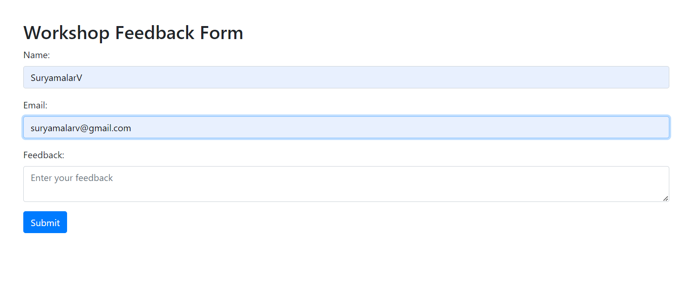
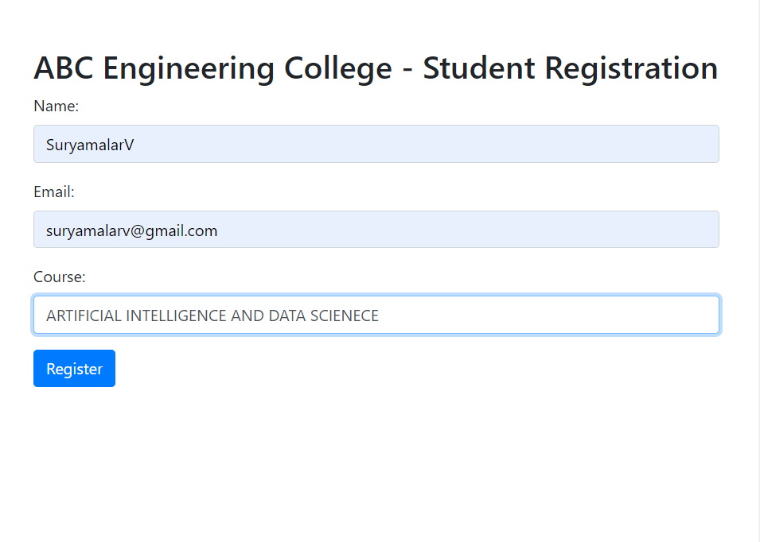
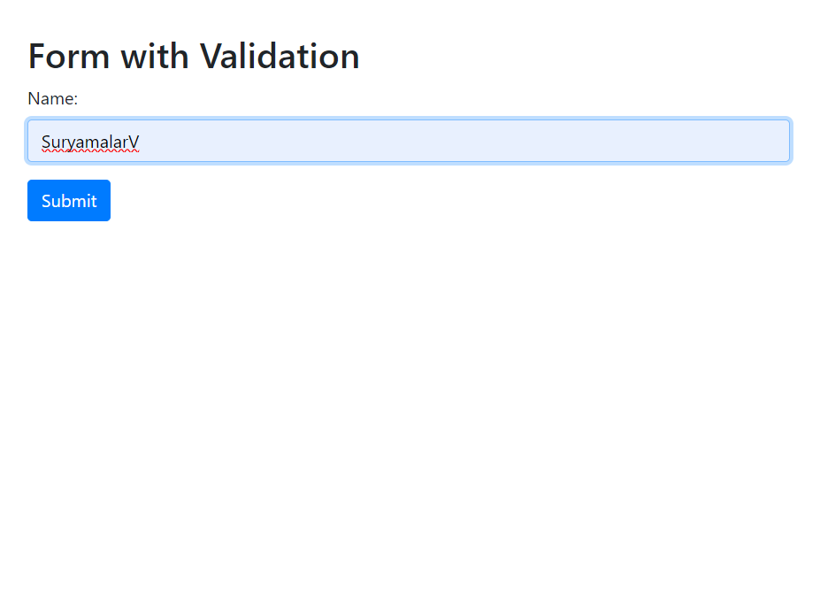
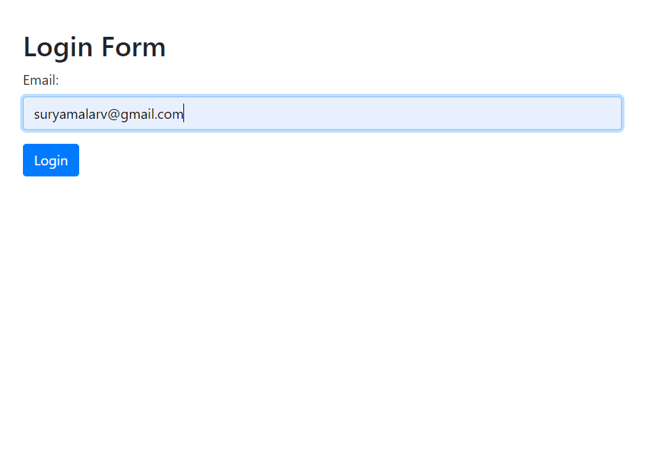

# Ex-10-BOOTSTRAP
# Ex-10(a)
# AIM:
Create a Responsive feedback form for a virtual workshop on Constructing Modern Websites built with Bootstrap.

# DESIGN STEPS: 10(a)
# Step 1:
Initialize the HTML document

# Step 2:
Create the body structure

# Step 3:
Construct the form

# Step 4:
Add a submit button and Link Bootstrap JavaScript.

# CODE: 10(a):
''' DEVELOPED BY:SURYAMALARV 
    REGISTER NO:212223230224
```
<!DOCTYPE html>
<html>
<head>
    <title>Feedback Form</title>
    <meta name="viewport" content="width=device-width, initial-scale=1">
    <link rel="stylesheet" href="https://stackpath.bootstrapcdn.com/bootstrap/4.3.1/css/bootstrap.min.css">
</head>
<body>
    <div class="container">
        <h2 class="mt-5">Workshop Feedback Form</h2>
        <form>
            <div class="form-group">
                <label for="name">Name:</label>
                <input type="text" class="form-control" id="name" placeholder="Enter your name" name="name">
            </div>
            <div class="form-group">
                <label for="email">Email:</label>
                <input type="email" class="form-control" id="email" placeholder="Enter your email" name="email">
            </div>
            <div class="form-group">
                <label for="feedback">Feedback:</label>
                <textarea class="form-control" id="feedback" placeholder="Enter your feedback" name="feedback"></textarea>
            </div>
            <button type="submit" class="btn btn-primary">Submit</button>
        </form>
    </div>
    <script src="https://stackpath.bootstrapcdn.com/bootstrap/4.3.1/js/bootstrap.min.js"></script>
</body>
</html>
```

# OUTPUT:10(a):



# RESULT:
This code creates a responsive feedback form for a virtual workshop on constructing modern websites built with Bootstrap.

# Ex-10(b)
# AIM:
Create a Responsive student registration form for ABC Engineering College built with Bootstrap.

# DESIGN STEPS: 10(b)
# Step 1:
Initialize the HTML document with the necessary Bootstrap links.

# Step 2:
Create a container for the form and add a heading.

# Step 3:
Inside the form, create form groups for the student’s name, email, and course.

# Step 4:
Add a submit button for the form.

# Step 5:
Link the Bootstrap JavaScript file at the end of the body.

# CODE: 10(b)
''' DEVELOPED BY:SURYAMALARV REGISTER NO:212223230224
```
<!DOCTYPE html>
<html>
<head>
    <title>Student Registration Form</title>
    <meta name="viewport" content="width=device-width, initial-scale=1">
    <link rel="stylesheet" href="https://stackpath.bootstrapcdn.com/bootstrap/4.3.1/css/bootstrap.min.css">
</head>
<body>
    <div class="container">
        <h2 class="mt-5">ABC Engineering College - Student Registration</h2>
        <form>
            <div class="form-group">
                <label for="name">Name:</label>
                <input type="text" class="form-control" id="name" placeholder="Enter your name" name="name">
            </div>
            <div class="form-group">
                <label for="email">Email:</label>
                <input type="email" class="form-control" id="email" placeholder="Enter your email" name="email">
            </div>
            <div class="form-group">
                <label for="course">Course:</label>
                <input type="text" class="form-control" id="course" placeholder="Enter your course" name="course">
            </div>
            <button type="submit" class="btn btn-primary">Register</button>
        </form>
    </div>
    <script src="https://stackpath.bootstrapcdn.com/bootstrap/4.3.1/js/bootstrap.min.js"></script>
</body>
</html>
```
# OUTPUT:10(b):


# RESULT:
This code creates a Responsive student registration form for ABC Engineering College built with Bootstrap.

# Ex-10(c)
# AIM:
Develop a program to structure vertical form layouts which handle form validation in bootstrap.

# DESIGN STEPS: 10(c)
# Step 1:
Initialize the HTML document with the necessary Bootstrap links.

# Step 2:
Create a container for the form and add a heading.

# Step 3:
Inside the form, create a form group for the name input field. Add the required attribute to the input field for validation.

# Step 4:
Add a submit button for the form.

# Step 5:
Add a script to handle the form validation on submit.

# CODE: 10(c)
''' DEVELOPED BY:SURYAMALARV  REGISTER NO:212223230224
```
<!DOCTYPE html>
<html>
<head>
    <title>Form Validation</title>
    <meta name="viewport" content="width=device-width, initial-scale=1">
    <link rel="stylesheet" href="https://stackpath.bootstrapcdn.com/bootstrap/4.3.1/css/bootstrap.min.css">
</head>
<body>
    <div class="container">
        <h2 class="mt-5">Form with Validation</h2>
        <form class="needs-validation" novalidate>
            <div class="form-group">
                <label for="name">Name:</label>
                <input type="text" class="form-control" id="name" placeholder="Enter your name" name="name" required>
                <div class="invalid-feedback">Please enter your name.</div>
            </div>
            <button type="submit" class="btn btn-primary">Submit</button>
        </form>
    </div>
    <script src="https://stackpath.bootstrapcdn.com/bootstrap/4.3.1/js/bootstrap.min.js"></script>
    <script>
    (function() {
        'use strict';
        window.addEventListener('load', function() {
            var forms = document.getElementsByClassName('needs-validation');
            var validation = Array.prototype.filter.call(forms, function(form) {
                form.addEventListener('submit', function(event) {
                    if (form.checkValidity() === false) {
                        event.preventDefault();
                        event.stopPropagation();
                    }
                    form.classList.add('was-validated');
                }, false);
            });
        }, false);
    })();
    </script>
</body>
</html>
```
# OUTPUT:10(c):


# RESULT:
This code develops a program to structure vertical form layouts which handle form validation in bootstrap.

# Ex-10(d)
# AIM:
Create a basic email login form in Bootstrap with validation function.

# DESIGN STEPS: 10(d)
# Step 1:
Initialize the HTML document with the necessary Bootstrap links.

# Step 2:
Create a container for the form and add a heading.

# Step 3:
Inside the form, create a form group for the email input field. Add the required attribute to the input field for validation.

# Step 4:
Add a submit button for the form.

# Step 5:
Add a script to handle the form validation on submit.

# CODE: 10(d)
''' DEVELOPED BY:SURYAMALARV  REGISTER NO:21223230224
```
<!DOCTYPE html>
<html>
<head>
    <title>Login Form</title>
    <meta name="viewport" content="width=device-width, initial-scale=1">
    <link rel="stylesheet" href="https://stackpath.bootstrapcdn.com/bootstrap/4.3.1/css/bootstrap.min.css">
</head>
<body>
    <div class="container">
        <h2 class="mt-5">Login Form</h2>
        <form class="needs-validation" novalidate>
            <div class="form-group">
                <label for="email">Email:</label>
                <input type="email" class="form-control" id="email" placeholder="Enter your email" name="email" required>
                <div class="invalid-feedback">Please enter a valid email.</div>
            </div>
            <button type="submit" class="btn btn-primary">Login</button>
        </form>
    </div>
    <script src="https://stackpath.bootstrapcdn.com/bootstrap/4.3.1/js/bootstrap.min.js"></script>
    <script>
    (function() {
        'use strict';
        window.addEventListener('load', function() {
            var forms = document.getElementsByClassName('needs-validation');
            var validation = Array.prototype.filter.call(forms, function(form) {
                form.addEventListener('submit', function(event) {
                    if (form.checkValidity() === false) {
                        event.preventDefault();
                        event.stopPropagation();
                    }
                    form.classList.add('was-validated');
                }, false);
            });
        }, false);
    })();
    </script>
</body>
</html>
```
# OUTPUT:10(d):


# RESULT:
This code creates a basic email login form in Bootstrap with validation function.
